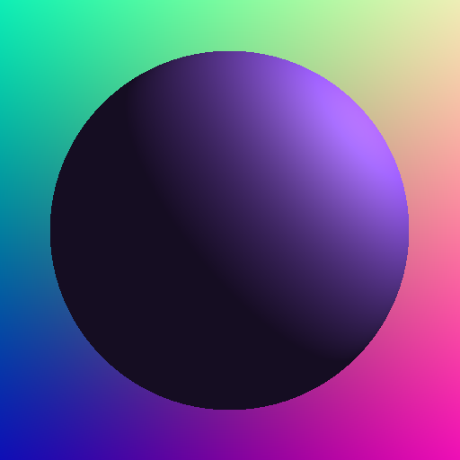

# Sphere Tracing with Graphics Interoperability

### Sphere Tracing + Shading
* init from <https://github.com/Nyriu/Esercizi_Esempi_CUDA/tree/main/06_rt_graphics_interop>
* Very simple implementation
* Background colored with ray directions

* Multiple lights with different colors

* Obj istantiation on device with class hierarchies and vtable

