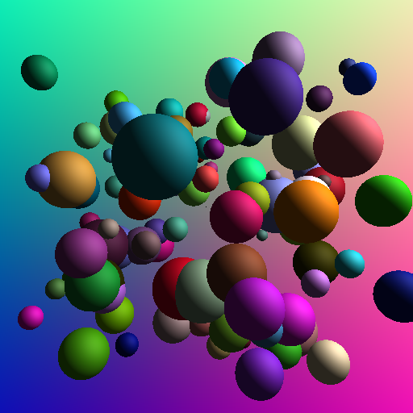
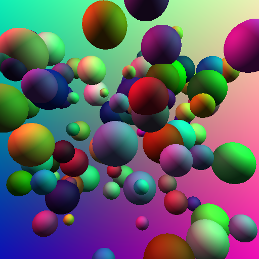
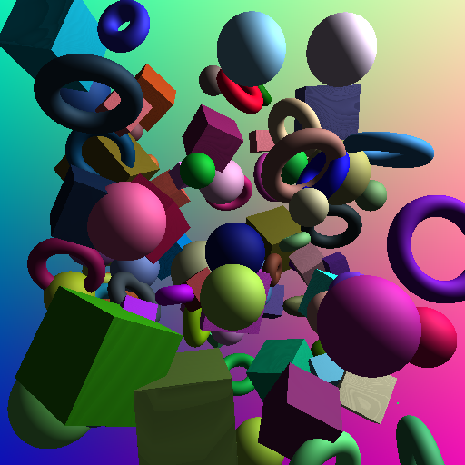
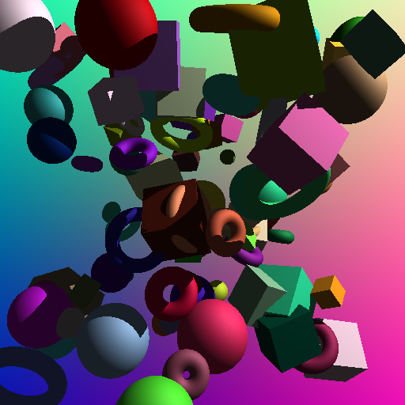
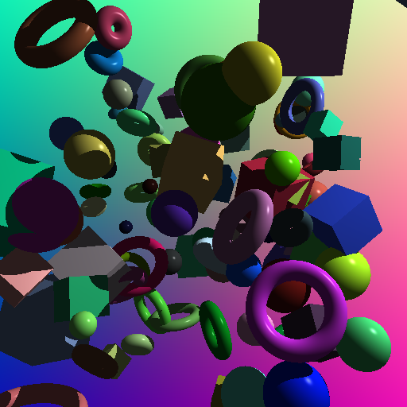
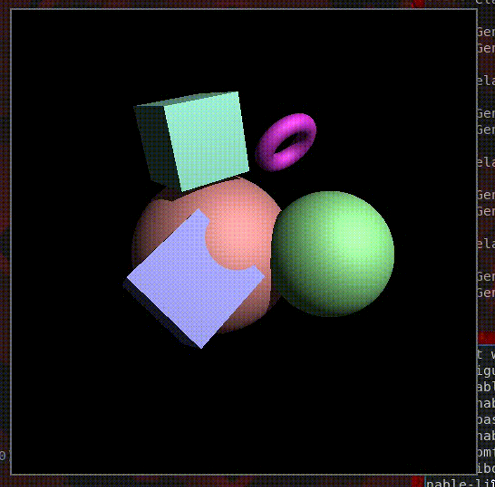

# Sphere Tracing with Graphics Interoperability

* init from <https://github.com/Nyriu/Esercizi_Esempi_CUDA/tree/main/06_rt_graphics_interop>
* Background colored with ray directions

* Multiple lights with different colors

* Obj istantiation on device with class hierarchies and vtable
* Spheres, cubes and toruses

* Shadows (and better cubes)

* Specular

* Scene update and real-time rendering

